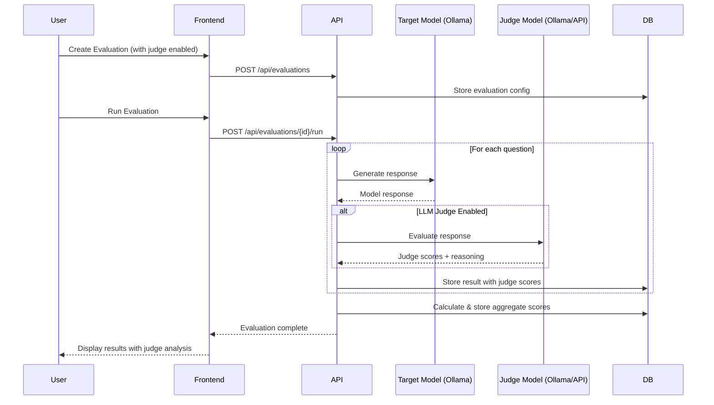

# LLM as Judge Implementation Plan

## Overview

This document outlines the implementation plan for adding **LLM as Judge** capability to Eval Forge. This feature uses a stronger LLM (e.g., GPT-4, Claude, or a local Llama model via Ollama) to evaluate the quality of responses from the model being evaluated, providing multi-dimensional scoring with reasoning.

### Why LLM as Judge?

As documented in [ai-eval-notes.md](file:///Users/jayanth_iyer/Documents/codebase/eval-forge/proj-docs/ai-eval-notes.md), the current evaluation system has limitations:
- **Simple Binary Scoring**: Only Correct/Incorrect classification
- **Basic String Matching**: No semantic understanding
- **Stochastic Outputs**: Traditional metrics struggle with varied but valid responses

LLM as Judge solves these by:
- **Multi-Aspect Scoring**: Rate Accuracy, Relevance, Clarity, Completeness separately
- **Chain-of-Thought Evaluation**: Judge explains its reasoning
- **Semantic Understanding**: Understands context and meaning, not just word matching

---

## User Review Required

> [!IMPORTANT]
> **Judge Model Selection**: The plan allows using any configured model as a judge (including Ollama models). For production use, you may want to restrict judge models to more capable models (GPT-4, Claude-3, Llama-3.1-70B).

> [!WARNING]
> **Cost Implications**: Using cloud API models (OpenAI, Anthropic) as judges will incur additional API costs. Each question evaluated requires an additional API call to the judge model.

---

## Proposed Changes

### Backend Changes

#### [NEW] [llm_judge.py](file:///Users/jayanth_iyer/Documents/codebase/eval-forge/backend/app/llm_judge.py)

Create a new module for LLM judge evaluation logic:

```python
# Core functionality:
# 1. LLMJudge class with configurable judge prompts
# 2. Multi-aspect evaluation (accuracy, relevance, clarity, completeness)
# 3. Support for Ollama and future API integrations
# 4. Structured output parsing with scores (1-5) and reasoning
```

**Key Components:**
- `LLMJudge` class with `evaluate_response()` method
- Default evaluation prompt template with multi-aspect scoring
- JSON parsing for structured judge responses
- Error handling for judge failures

---

#### [MODIFY] [models.py](file:///Users/jayanth_iyer/Documents/codebase/eval-forge/backend/app/models.py)

Add judge-related fields to existing models:

**Evaluation model - add fields:**
```python
# Judge configuration
judge_model_id = Column(Integer, ForeignKey("models.id"), nullable=True)
use_llm_judge = Column(Boolean, default=False)
judge_prompt_template = Column(Text, nullable=True)

# Aggregate judge scores
avg_judge_accuracy = Column(Float, nullable=True)
avg_judge_relevance = Column(Float, nullable=True)
avg_judge_clarity = Column(Float, nullable=True)
avg_judge_completeness = Column(Float, nullable=True)
avg_judge_overall = Column(Float, nullable=True)
```

**Result model - add fields:**
```python
# LLM Judge scores (1-5 scale)
judge_accuracy_score = Column(Float, nullable=True)
judge_relevance_score = Column(Float, nullable=True)
judge_clarity_score = Column(Float, nullable=True)
judge_completeness_score = Column(Float, nullable=True)
judge_overall_score = Column(Float, nullable=True)
judge_reasoning = Column(Text, nullable=True)
judge_raw_response = Column(Text, nullable=True)
```

---

#### [MODIFY] [schemas.py](file:///Users/jayanth_iyer/Documents/codebase/eval-forge/backend/app/schemas.py)

Add Pydantic schemas for judge-related data:

```python
class EvaluationBase(BaseModel):
    # ... existing fields ...
    use_llm_judge: bool = False
    judge_model_id: Optional[int] = None
    judge_prompt_template: Optional[str] = None

class Evaluation(EvaluationBase):
    # ... existing fields ...
    # Judge aggregate scores
    avg_judge_accuracy: Optional[float] = None
    avg_judge_relevance: Optional[float] = None
    avg_judge_clarity: Optional[float] = None
    avg_judge_completeness: Optional[float] = None
    avg_judge_overall: Optional[float] = None

class Result(ResultBase):
    # ... existing fields ...
    # Judge scores
    judge_accuracy_score: Optional[float] = None
    judge_relevance_score: Optional[float] = None
    judge_clarity_score: Optional[float] = None
    judge_completeness_score: Optional[float] = None
    judge_overall_score: Optional[float] = None
    judge_reasoning: Optional[str] = None

class JudgeScores(BaseModel):
    """Structured judge evaluation output"""
    accuracy: float
    relevance: float
    clarity: float
    completeness: float
    overall: float
    reasoning: str
```

---

#### [MODIFY] [main.py](file:///Users/jayanth_iyer/Documents/codebase/eval-forge/backend/app/main.py)

Integrate LLM judge into evaluation flow:

**Update `create_evaluation` endpoint:**
- Add form parameters for `use_llm_judge`, `judge_model_id`, `judge_prompt_template`

**Update `run_evaluation` endpoint (~lines 181-311):**
- After getting model response, if `use_llm_judge` is enabled:
  1. Initialize LLMJudge with judge model configuration
  2. Call `judge.evaluate_response(question, expected_answer, model_response)`
  3. Parse and store judge scores in Result record
- Calculate aggregate judge scores on Evaluation record

**Add new endpoint:**
```python
@app.get("/api/judge-prompts/default")
def get_default_judge_prompt():
    """Return the default judge prompt template for customization"""
```

---

### Frontend Changes

#### [MODIFY] [Evaluations.jsx](file:///Users/jayanth_iyer/Documents/codebase/eval-forge/src/pages/Evaluations.jsx)

**New Evaluation Form Updates:**
- Add "Enable LLM as Judge" toggle switch
- Add "Judge Model" dropdown (populated from models list)
- Add "Custom Prompt Template" optional textarea with default template
- Conditional display: show judge options only when toggle is enabled

---

#### [MODIFY] [Results.jsx](file:///Users/jayanth_iyer/Documents/codebase/eval-forge/src/pages/Results.jsx)

**Results Display Updates:**
- Add judge scores section in summary (if judge was used)
- Display individual judge dimensions with visual bars/gauges
- Show judge reasoning in expandable details for each question
- Add filter by judge score (e.g., "Show Low Judge Scores")

---

### Database Migration

#### [NEW] [migrate_judge_fields.py](file:///Users/jayanth_iyer/Documents/codebase/eval-forge/backend/migrate_judge_fields.py)

Migration script to add judge columns to existing database:

```python
# ALTER TABLE evaluations ADD COLUMN judge_model_id INTEGER ...
# ALTER TABLE evaluations ADD COLUMN use_llm_judge BOOLEAN ...
# ALTER TABLE results ADD COLUMN judge_accuracy_score FLOAT ...
# etc.
```

---

## Architecture Diagram



---

## Verification Plan

### Automated Tests

#### Unit Tests for LLM Judge Module

Create test file: [test_llm_judge.py](file:///Users/jayanth_iyer/Documents/codebase/eval-forge/backend/test_llm_judge.py)

```bash
# Run from backend directory:
cd /Users/jayanth_iyer/Documents/codebase/eval-forge/backend
source venv/bin/activate
python -m pytest test_llm_judge.py -v
```

Tests to include:
1. Test judge prompt generation
2. Test score parsing from JSON response
3. Test error handling for malformed judge responses
4. Test default prompt template

#### Run Existing Tests

```bash
# Run all existing tests to verify no regression:
cd /Users/jayanth_iyer/Documents/codebase/eval-forge/backend
source venv/bin/activate
python -m pytest test_*.py -v
```

### Manual Verification

#### 1. End-to-End Judge Evaluation Test

**Prerequisites:**
- Backend running: `cd backend && python run.py`
- Frontend running: `npm run dev`
- Ollama running with a model: `ollama run llama3.2`

**Steps:**
1. Navigate to http://localhost:3000
2. Go to **Models** page
3. Add two Ollama models (one as target, one as judge):
   - Target: Name="Llama Target", Endpoint="http://localhost:11434", Model="llama3.2"
   - Judge: Name="Llama Judge", Endpoint="http://localhost:11434", Model="llama3.2"
4. Go to **Evaluations** page
5. Create new evaluation:
   - Name: "Judge Test"
   - Model: Select "Llama Target"
   - Dataset: Use sample dataset
   - Enable "LLM as Judge" toggle
   - Select "Llama Judge" as judge model
6. Run the evaluation
7. Wait for completion
8. Go to **Results** page
9. **Verify:**
   - Judge scores (Accuracy, Relevance, Clarity, Completeness, Overall) are displayed
   - Judge reasoning is shown for each question
   - Aggregate judge scores are shown in summary

#### 2. Judge Disabled Test

**Steps:**
1. Create a new evaluation WITHOUT enabling LLM as Judge
2. Run evaluation
3. **Verify:** No judge scores are displayed, results look same as before

---

## Implementation Order

1. **Database & Models** (Day 1)
   - Add columns to models.py
   - Create migration script
   - Update schemas.py

2. **LLM Judge Module** (Day 1-2)
   - Create llm_judge.py
   - Write unit tests
   - Test with Ollama locally

3. **API Integration** (Day 2)
   - Update create_evaluation endpoint
   - Update run_evaluation endpoint
   - Add default prompt endpoint

4. **Frontend Updates** (Day 3)
   - Update Evaluations.jsx with judge options
   - Update Results.jsx with judge display
   - Style and polish UI

5. **Testing & Documentation** (Day 3)
   - Run all tests
   - Manual end-to-end testing
   - Update README if needed

---

## Future Enhancements

- **Custom Scoring Dimensions**: Allow users to define their own evaluation criteria
- **Judge Calibration**: Compare judge scores with human annotations
- **Multiple Judges**: Use consensus from multiple judge models
- **Judge Performance Dashboard**: Track judge consistency and reliability
